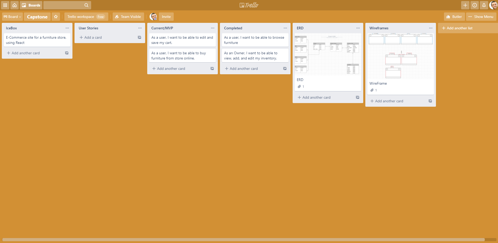
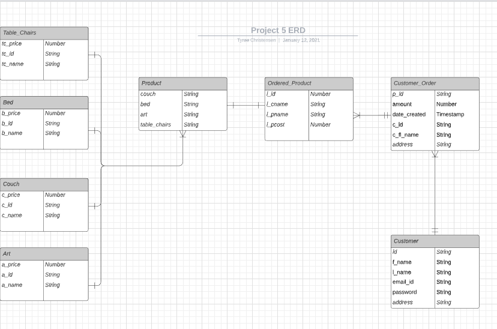
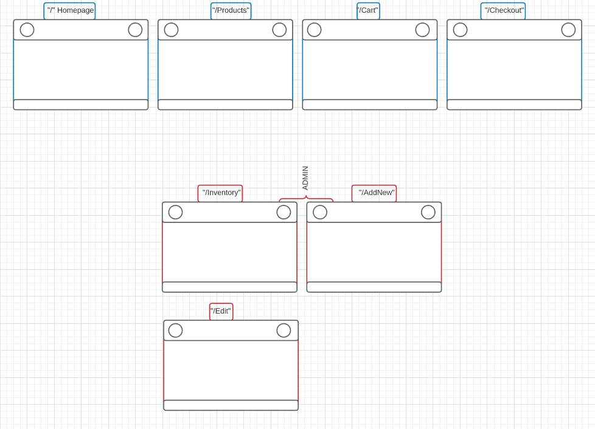
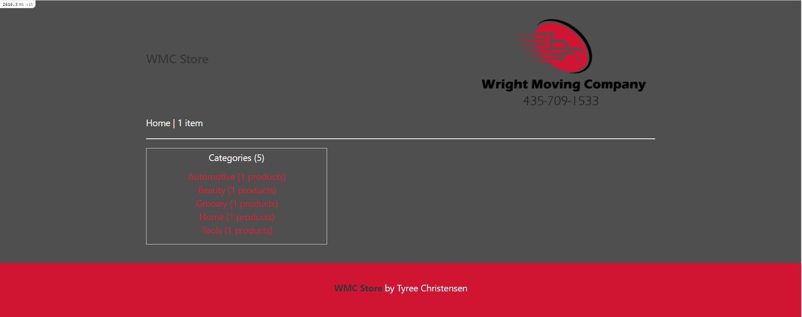
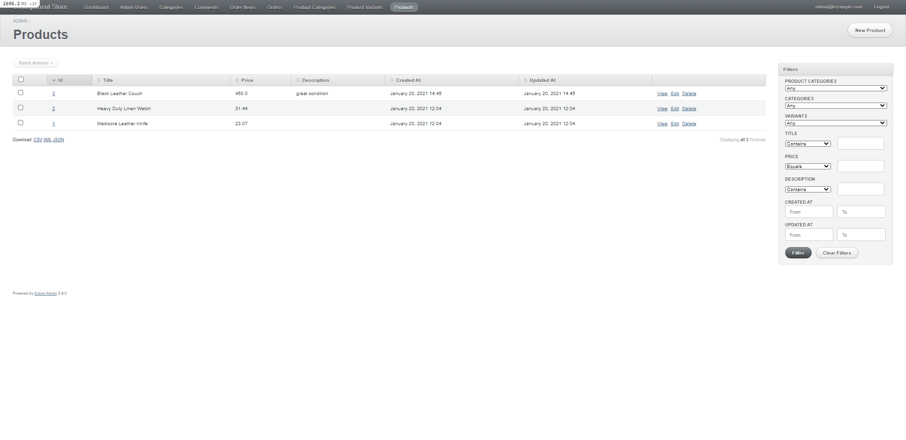

# README

# WMC Consignment Store
a simple web application where you can shop for furniture sold in-store.

## Technologies Used
* Ruby
* Rails
* HTML
* JavaScript
* CSS
* Jquery
* ActiveAdmin Gem
* Faker Gem
* Trello Board
* ZiteBoard
* Netlify

## Screenshots

# Trello

# ERD

# WireFrame

# Screenshots

### Getting started
<a href="https://wmc-consignment-store.netlify.app">Click here to see the deployed app!</a>

### Future Items
finish checkout
continue work with Active Admin
post pictures to products and save as data

#### Explanation
used React.js to make a SPA. in order to make the app more response without refresing. used components to structure and style the entire page.

used Express.js, mongoDB and mongoose to set up my database. users are able to register and save their information in the DB. passwords are encrypted and Salted.

#### Approach
-I use the trello board to design the approach a user would take once inside the app. I was able to design it with a wireframe. With those two ready I was able to move forward with my project.

#### To Run Website
 gem install bundler

 bundle install
 
 open http://localhost:3000

Things you may want to cover:

* Ruby version

* System dependencies

* Configuration

* Database creation

* Database initialization

* How to run the test suite

* Services (job queues, cache servers, search engines, etc.)

* Deployment instructions

* ...
